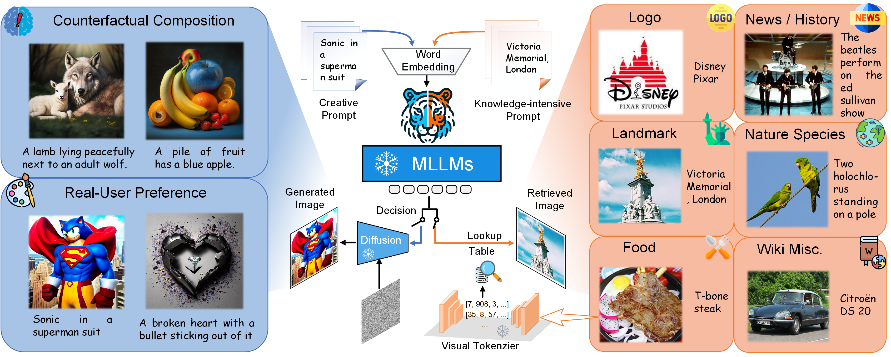
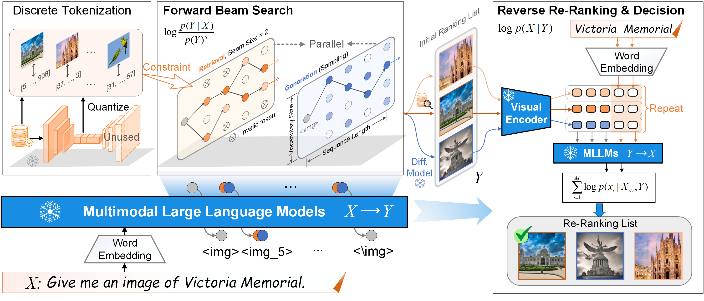

# TIGeR

<h3><a href="">Unified Text-to-Image Generation and Retrieval</a></h3>

[Leigang Qu](https://lgqu.github.io/), [Haochuan Li](), [Tan Wang*](https://wangt-cn.github.io/), [Wenjie Wang*](https://wenjiewwj.github.io/), [Yongqi Li](https://liyongqi67.github.io/), [Liqiang Nie](https://liqiangnie.github.io/), and [Tat-Seng Chua](https://www.chuatatseng.com/)

<a href='https://tiger-t2i.github.io/'></a> <a href='https://arxiv.org/abs/2406.05814'></a>

This repository contains code and links to the Unified Text-to-Image Generation and Retrieval (**TIGeR**) work. We show the potential of intrinsic discriminative abilities of current Multimodal Large Language Models (MLLMs) and propose a training-free method to unify text-to-image generation and retrieval. Besides, we build a benchmark called TIGeR-Bench to comprehensively evaluate the unified performance across recent MLLMs. 




## Introduction

Overview of the framework to unify text-to-image generation and retrieval. Images from the database are first tokenized into discrete codes and a lookup table is maintained for the correspondence between discrete codes and images. The given prompt X is first fed into a MLLM and Forward Beam Search is performed to retrieve and generate images in parallel. The prompt and obtained images are then fed into the same MLLM for Reverse Re-Ranking and Decision-making.




## Release

- [ ] Release the evaluation code for the unified task and the retrieval task. 
- [ ] Release the inference code for unified text-to-image generation and retrieval. 
- [x] **2024-6-9** Release the paper of TIGeR on [arXiv](https://arxiv.org/abs/2406.05814). 


## Acknowledgement

We thank the authors of [SEED-LLaMA](https://github.com/AILab-CVC/SEED) and [LaVIT](https://github.com/jy0205/LaVIT) for making their code available.

If you find our work useful in your research, please consider citing TIGeR:

```tex
@article{qu2024unified,
  title={Unified Text-to-Image Generation and Retrieval},
  author={Qu, Leigang and Li, Haochuan and Wang, Tan and Wang, Wenjie and Li, Yongqi and Nie, Liqiang and Chua, Tat-Seng},
  journal={arXiv preprint arXiv:2406.05814},
  year={2024}
}
```

