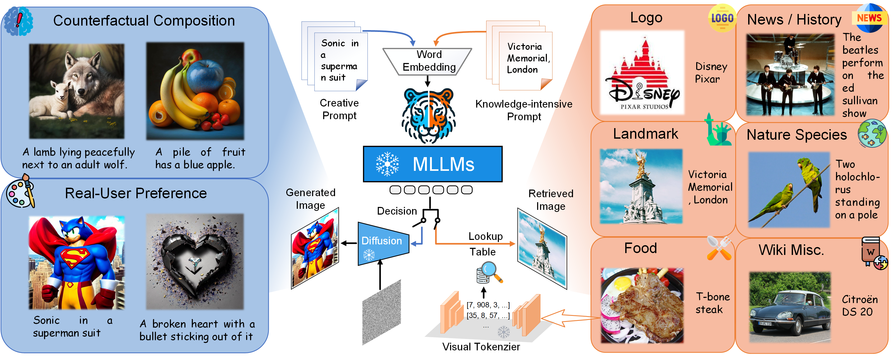
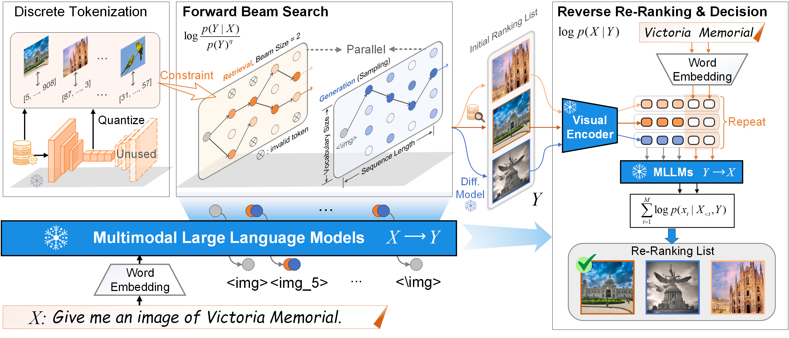

# TIGeR: Unified Text-to-Image Generation and Retrieval

[](https://tiger-t2i.github.io/)
[](https://arxiv.org/abs/2406.05814)
[](https://huggingface.co/datasets/leigangqu/TIGeR-Bench)
[](LICENSE)

[Leigang Qu](https://leigang-qu.github.io/), Haochuan Li, [Tan Wang](https://wangt-cn.github.io/)<sup>&ast;</sup>, [Wenjie Wang](https://wenjiewwj.github.io/)<sup>&ast;</sup>, [Yongqi Li](https://liyongqi67.github.io/), [Liqiang Nie](https://liqiangnie.github.io/), and [Tat-Seng Chua](https://www.chuatatseng.com/)

<sup>&ast;</sup> Corresponding authors

TIGeR is a training-free framework that lets a multimodal large language model choose between two actions for a text prompt:

1. retrieve the best matching image from a gallery; or
2. generate a new image when the gallery is not suitable.

This repository provides organized **SEED-LLaMA** and **LaVIT** implementations for **TIGeR-Bench**.



## Contents

- [What TIGeR does](#what-tiger-does)
- [Installation](#installation)
- [Model checkpoints](#model-checkpoints)
- [Quick start](#quick-start)
- [Run individual stages](#run-individual-stages)
- [Outputs](#outputs)
- [Configuration](#configuration)
- [Troubleshooting](#troubleshooting)
- [Citation](#citation)

## What TIGeR does

TIGeR represents gallery images as discrete visual tokens and uses the same MLLM throughout the pipeline:

1. **Prepare the gallery:** tokenize TIGeR-Bench images and compute unconditional gallery priors.
2. **Retrieve:** use constrained forward beam search to rank gallery images for each prompt.
3. **Generate:** produce a candidate image for each prompt.
4. **Rerank:** score retrieved candidates in the reverse image-to-text direction.
5. **Route:** compare retrieval and generation likelihoods and select the better action.
6. **Evaluate:** report retrieval, generation, and unified-task metrics.



TIGeR-Bench is downloaded directly from [Hugging Face](https://huggingface.co/datasets/leigangqu/TIGeR-Bench). No user-specific dataset paths are required.

## Installation

The released environment targets Linux, Python 3.8, NVIDIA GPUs, and CUDA-compatible PyTorch.

Choose a backend and use its own environment: SEED and LaVIT require different dependency versions. The instructions below cover SEED; see the [LaVIT guide](LaVIT/README.md) for LaVIT setup and usage.

```bash
git clone https://github.com/LgQu/TIGeR.git
cd TIGeR/SEED

conda create -n tiger python=3.8 -y
conda activate tiger
python -m pip install --upgrade pip
python -m pip install -r requirements.txt
```

The dependency versions are pinned for compatibility with the released SEED-LLaMA implementation, including `transformers==4.29.2`.

## Model checkpoints

Download the official SEED-LLaMA tokenizer, language model, and diffusion decoder from the [SEED repository](https://github.com/AILab-CVC/SEED). The expected layout is:

```text
checkpoints/
└── seed-llama-8b-sft/
    └── ... model files ...

seed_llama_tokenizer_hf/
└── ... tokenizer files ...

diffusion_model/
└── ... diffusion model files ...
```

Point TIGeR to these directories:

```bash
export CKPT_ROOT=/path/to/checkpoints
export TOKENIZER_ROOT=/path/to/seed_llama_tokenizer_hf
export DIFFUSION_ROOT=/path/to/diffusion_model
export CUDA_VISIBLE_DEVICES=0
```

`CKPT_ROOT` is the parent directory of `seed-llama-8b-sft`, while `TOKENIZER_ROOT` and `DIFFUSION_ROOT` point directly to their respective model directories.

The benchmark is public, so authentication is normally unnecessary. If your environment requires it, set `HF_TOKEN`. You may also set `HF_HOME` or `HF_DATASETS_CACHE` to choose a cache location.

## Quick start

All commands below are run from the `SEED` directory.

First, inspect the complete workflow without loading a model or creating outputs:

```bash
DRY_RUN=1 bash prepare_benchmark.sh all
DRY_RUN=1 bash run_pipeline.sh all
```

Then prepare TIGeR-Bench. This tokenizes the images and computes the unconditional gallery priors used by retrieval:

```bash
bash prepare_benchmark.sh all
```

Finally, run retrieval, generation, reverse reranking, routing, and evaluation:

```bash
bash run_pipeline.sh all
```

These are large GPU jobs. For long-running experiments, running one stage at a time is easier to monitor and resume.

## Run individual stages

### Benchmark preparation

```bash
# Encode benchmark images and prompts.
bash prepare_benchmark.sh tokenize

# Compute unconditional gallery scores and logits.
bash prepare_benchmark.sh priors
```

The `priors` stage requires the files produced by `tokenize`.

### TIGeR pipeline

```bash
bash run_pipeline.sh retrieve
bash run_pipeline.sh generate
bash run_pipeline.sh rerank
bash run_pipeline.sh route
bash run_pipeline.sh evaluate
```

Run these stages in the listed order. Their dependencies are:

| Stage | Requires | Main result |
| --- | --- | --- |
| `retrieve` | benchmark tokens and priors | forward retrieval ranking |
| `generate` | benchmark tokens | generated image tokens and images |
| `rerank` | retrieval ranking | reverse-reranked candidates |
| `route` | reranked candidates and generated tokens | retrieval/generation decision scores |
| `evaluate` | rankings, decisions, and decoded images | unified evaluation report |

## Outputs

Generated artifacts are kept inside `SEED` and ignored by Git:

```text
SEED/
├── intermediate_results/tiger_bench/
│   ├── img_ids_*.pt
│   ├── t2i_mat_*.pt
│   ├── sumlogprobs_*.pt
│   └── uncond_logits_*.pt
├── generated/tiger_bench/
│   ├── ids_*.pt
│   └── images/
└── results/tiger_bench/
    ├── retrieval.pt
    ├── rerank_retrieval.pt
    ├── decision.pt
    └── ... evaluation reports ...
```

The most important files are:

- `retrieval.pt`: rankings produced by forward beam search.
- `rerank_retrieval.pt`: rankings after reverse reranking.
- `decision.pt`: likelihoods used to choose retrieval or generation.

## Configuration

The scripts expose commonly adjusted settings as environment variables:

| Variable | Default | Description |
| --- | ---: | --- |
| `MODEL_VERSION` | `8b` | SEED-LLaMA model size; use `8b` or `14b` |
| `NUM_BEAMS` | `800` | number of beams used for retrieval |
| `TOKENIZE_BATCH_SIZE` | `128` | image-tokenization batch size |
| `PRIOR_BATCH_SIZE` | `64` | unconditional-prior batch size |
| `RANK_BATCH_SIZE` | `128` | retrieval/reranking batch size |
| `ROUTE_BATCH_SIZE` | `32` | routing batch size |
| `GENERATION_STEPS` | `25` | diffusion decoding steps |
| `RANDOM_SEED` | `42` | generation random seed |
| `DATA_VERSION` | `tiger_bench` | output subdirectory name |

For example:

```bash
NUM_BEAMS=200 RANK_BATCH_SIZE=32 bash run_pipeline.sh retrieve
```

To use the 14B checkpoint:

```bash
export MODEL_VERSION=14b
export CKPT_ROOT=/path/to/checkpoints
bash prepare_benchmark.sh priors
bash run_pipeline.sh all
```

In this case, `CKPT_ROOT` must contain `seed-llama-14b-sft`.

## Troubleshooting

### A required environment variable is missing

Make sure all three model locations are set:

```bash
echo "$CKPT_ROOT"
echo "$TOKENIZER_ROOT"
echo "$DIFFUSION_ROOT"
```

### CUDA out of memory

Reduce the batch size for the failing stage. For retrieval, also reduce `NUM_BEAMS`:

```bash
NUM_BEAMS=200 RANK_BATCH_SIZE=16 bash run_pipeline.sh retrieve
```

Reducing `NUM_BEAMS` changes the retrieval configuration and may affect the reported results.

### Hugging Face download or cache errors

Choose a writable cache directory and, if necessary, provide a token:

```bash
export HF_HOME=/path/to/huggingface_cache
export HF_TOKEN=your_huggingface_token
```

Never commit access tokens to the repository.

### Transformers version error

The custom SEED implementation requires the pinned version:

```bash
python -m pip install "transformers==4.29.2"
```

## Project structure

```text
TIGeR/
├── assets/                  # paper figures
├── SEED/
│   ├── configs/             # model and tokenizer configuration
│   ├── models/              # SEED-LLaMA and image tokenizer
│   ├── transformers_patch/  # generation behavior required by SEED
│   ├── prepare_benchmark.sh # benchmark preprocessing entry point
│   ├── run_pipeline.sh      # TIGeR inference/evaluation entry point
│   └── README.md            # backend-specific reference
├── LaVIT/
│   ├── models/              # LaVIT model and visual tokenizer
│   ├── prepare_benchmark.sh # benchmark preprocessing entry point
│   ├── run_pipeline.sh      # TIGeR inference/evaluation entry point
│   └── README.md            # LaVIT setup and usage
├── LICENSE
└── README.md
```

## Acknowledgements

This work builds on [SEED-LLaMA](https://github.com/AILab-CVC/SEED) and [LaVIT](https://github.com/jy0205/LaVIT). See the notices for [SEED](SEED/THIRD_PARTY_NOTICES.md) and [LaVIT](LaVIT/THIRD_PARTY_NOTICES.md) for attribution and license details.

## Citation

If you find TIGeR useful, please cite:

```bibtex
@article{qu2024unified,
  title   = {Unified Text-to-Image Generation and Retrieval},
  author  = {Qu, Leigang and Li, Haochuan and Wang, Tan and Wang, Wenjie and Li, Yongqi and Nie, Liqiang and Chua, Tat-Seng},
  journal = {arXiv preprint arXiv:2406.05814},
  year    = {2024}
}
```

## License

Original TIGeR code is released under the [Apache License 2.0](LICENSE). The LaVIT-derived code under `LaVIT/` is governed by the [LaVIT Community License Agreement](LaVIT/LICENSE) and [use policy](LaVIT/USE_POLICY.md). Model checkpoints and other third-party components retain their upstream terms.
